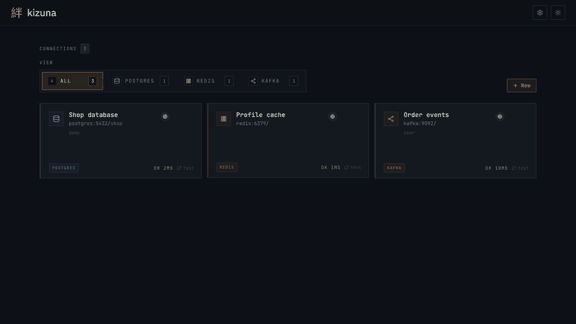
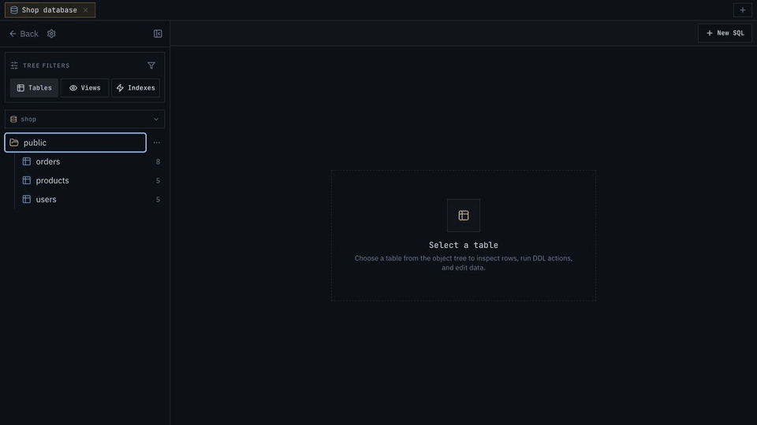
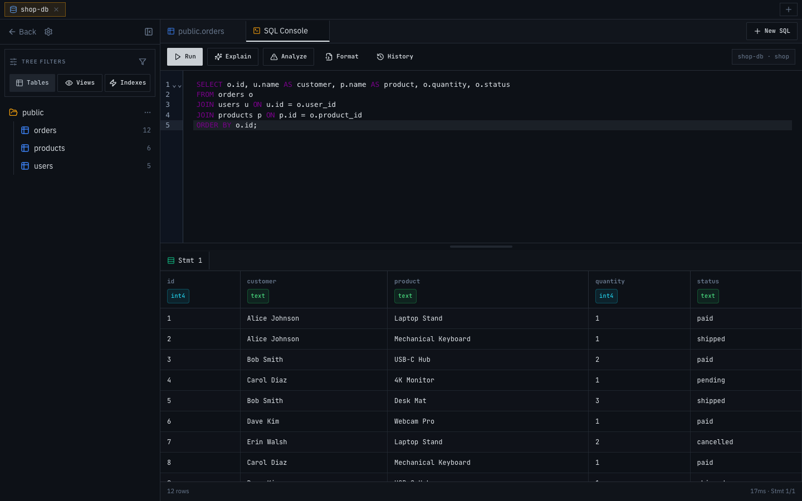
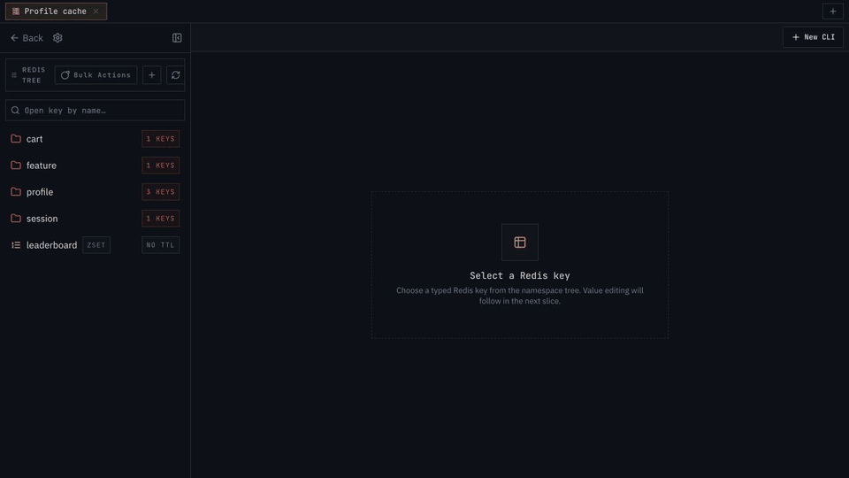
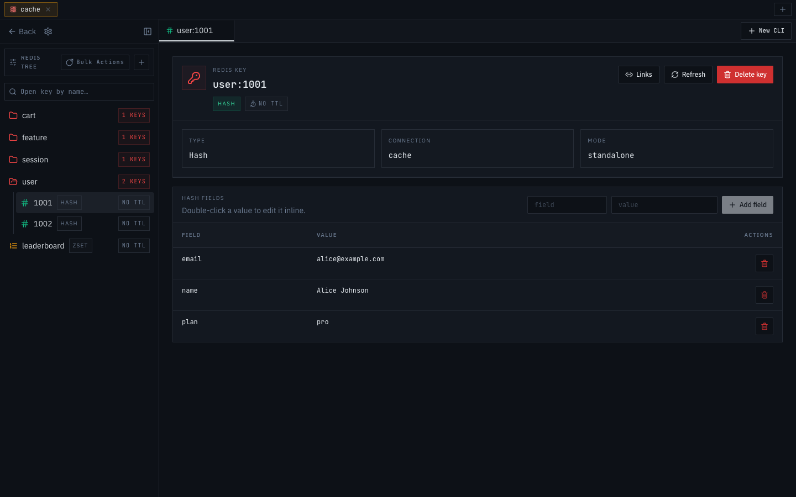
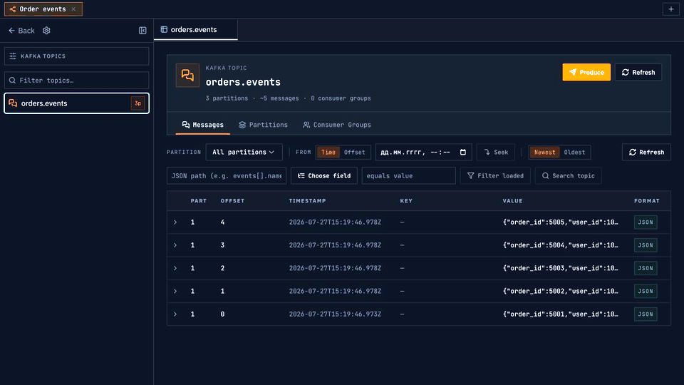
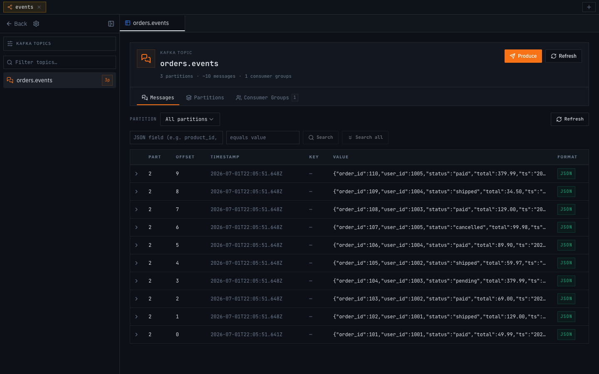
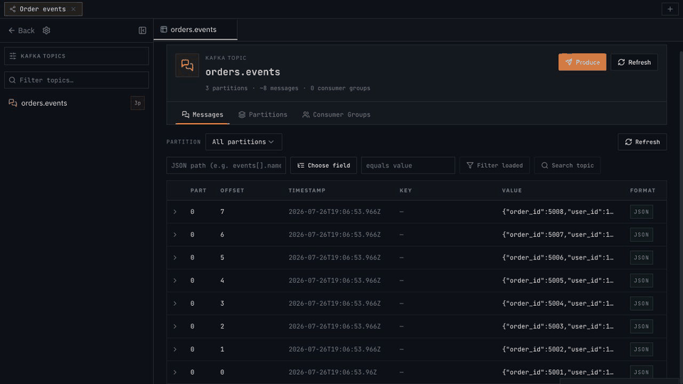
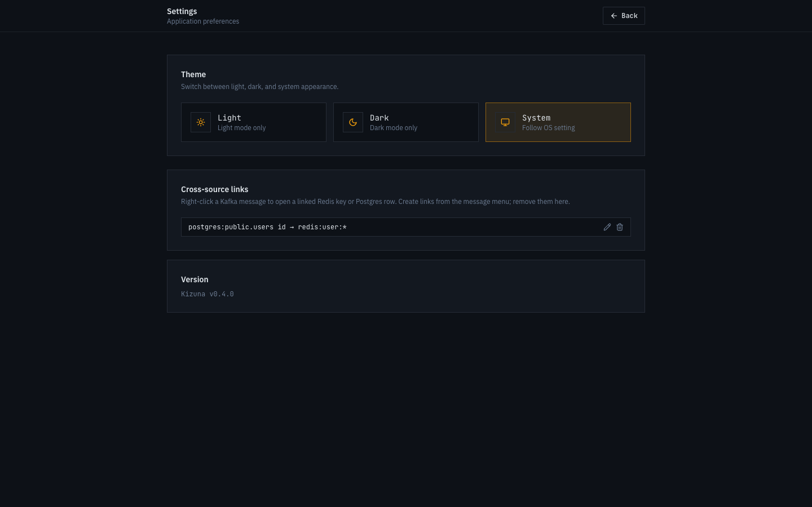

<div align="center">

# 絆 kizuna

<p><strong>One web interface for PostgreSQL, Redis, and Kafka.</strong><br>
Browse data, work with messages, and follow related records without switching tools.</p>

[](LICENSE)
[](https://go.dev)
[](https://react.dev)

[Русский](README.md) · English

</div>

## Why Kizuna

Kizuna replaces a scattered set of pgAdmin, Redis Desktop Manager, and Kafka UI with one compact application. Its goal is to make everyday data work faster: open a table, key, or message, change what you need, then jump straight to the related entity in another source.

It is a self-hosted tool for engineers, analysts, and support teams. In production it runs as one container and never sends your data to an external service.

## Quick Start

```bash
git clone https://github.com/zxchlorka/kizuna.git
cd kizuna
docker compose up -d --build
```

Open [http://localhost:9090](http://localhost:9090) and add your first connection. Configuration lives in the `kizuna-data` Docker volume; connection passwords are encrypted with AES-256-GCM.

<details>
<summary><b>Run from source</b></summary>

Requires Go 1.26+ and Node 20+.

```bash
cd frontend && npm install && npm run build && cd ..
go run ./cmd/kizuna
```

The frontend is embedded in one Go binary; the app listens on port `9090`.

</details>

## Connections

Connect all three source types from one wizard: **PostgreSQL**, **Redis**, and **Kafka**. Redis supports standalone, Cluster, and Sentinel; Kafka supports multiple brokers, SASL, and TLS with a custom CA bundle.

<p align="center">
  
</p>

## PostgreSQL — from schema to query

Open a schema, table, or view directly from the tree. The table view provides sorting, filters, pagination, column types, and quick foreign-key navigation. Edit mode supports bulk changes, row creation, and deletion, while breadcrumbs retain navigation context.

<p align="center">
  
</p>

- SQL console with autocomplete, history, multi-statement scripts, safe `EXPLAIN`, and confirmed `EXPLAIN ANALYZE`.
- DDL actions and an index inspector without switching to another client.
- Forward and reverse foreign keys: jump to a parent row, inspect **Referenced By**, and return through breadcrumbs.



## Redis — keys, types, and CLI

The key tree is grouped by prefix. Kizuna opens the right editor for String, Hash, List, Set, Sorted Set, Stream, and RedisJSON; TTL, key creation, and bulk actions stay in the same workspace.

The built-in Redis CLI formats command output and adds an `open <key>` button for a recognized key. After `HGETALL profile:1001`, for example, you can open `profile:1001` in its typed editor immediately—without copying the key name.

<p align="center">
  
</p>



## Kafka — messages and controlled produce

Browse topics, partitions, consumer groups, and JSON messages in one view. Message fields can also drive filters and related-data navigation.

The producer can send one message, a batch of comma-separated JSON objects in **Multi** mode, or a template-expanded batch in **Loop** mode. Before publishing, Kizuna previews every exact message, so you can validate `{{i}}` expressions, step, and count before writing to Kafka.

<p align="center">
  
</p>



## Cross-source links

Links are Kizuna's core idea. Describe once how a value from PostgreSQL, Redis, or Kafka points to another system, then open related data from its context menu.

In the demo below, the path is: Kafka message `user_id` → Redis key `profile:1001` → filtered `public.orders` rows in PostgreSQL → back to the Redis profile. The filter, breadcrumb, and reverse-navigation menu are created automatically.

<p align="center">
  
</p>



## One container

- Dark, light, and system themes.
- One Go binary with the embedded React frontend: one container, one port.
- Lazy source connections and encrypted passwords in local configuration.

## License

[Apache 2.0](LICENSE)
