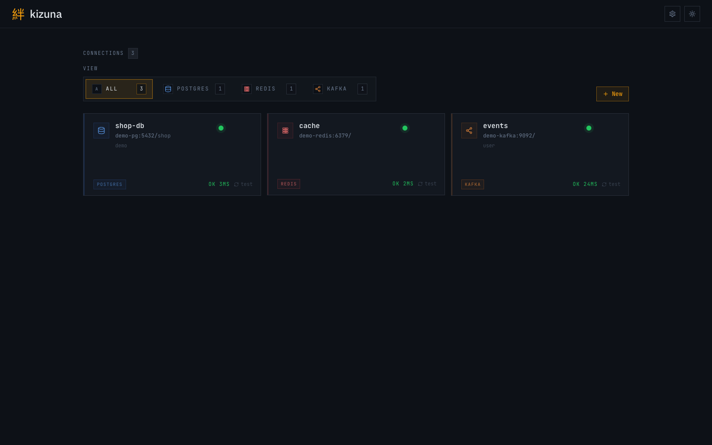
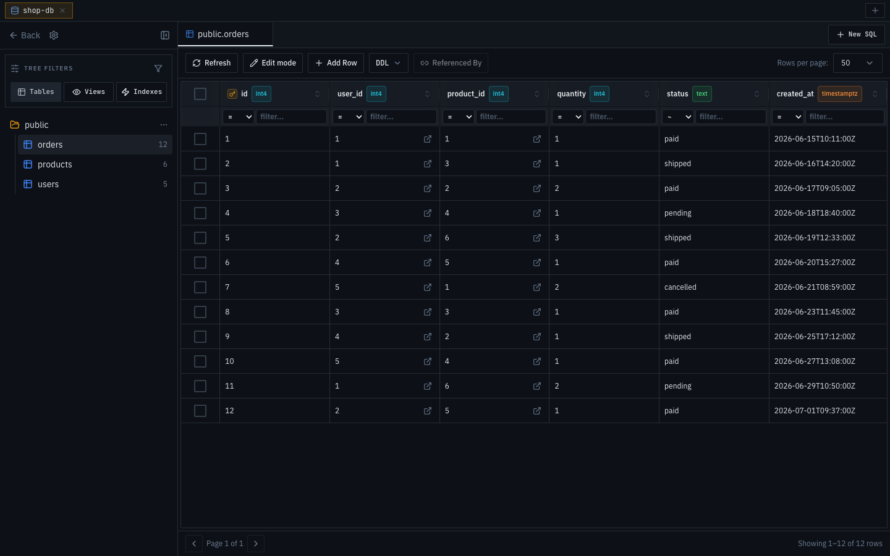
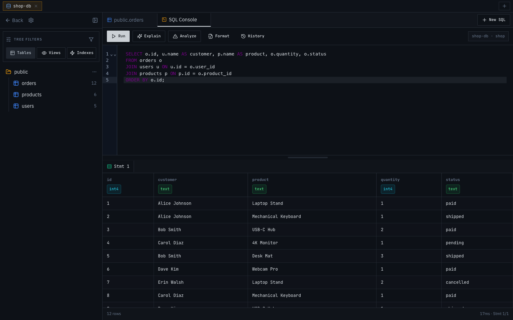
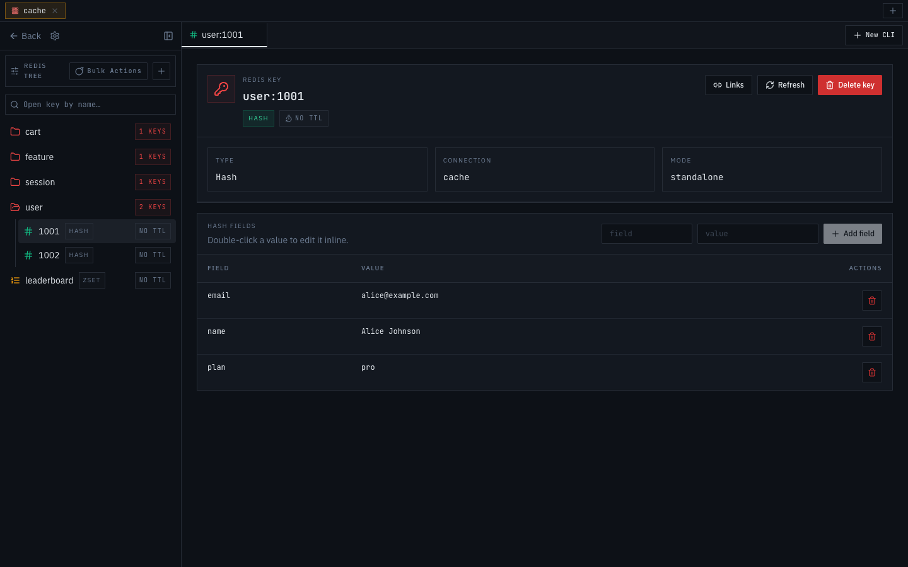
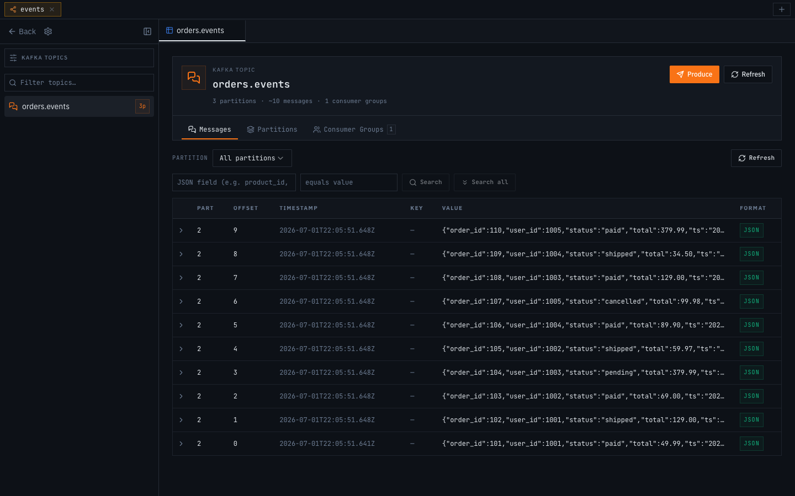
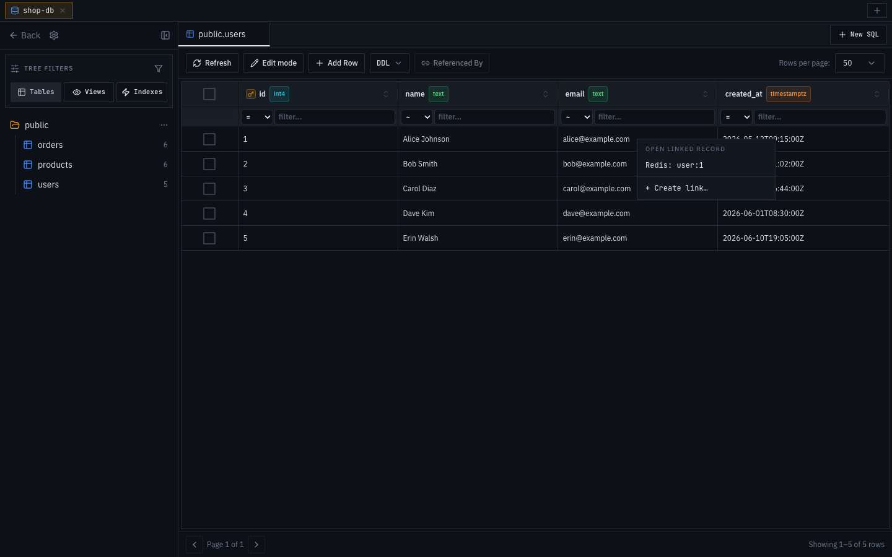
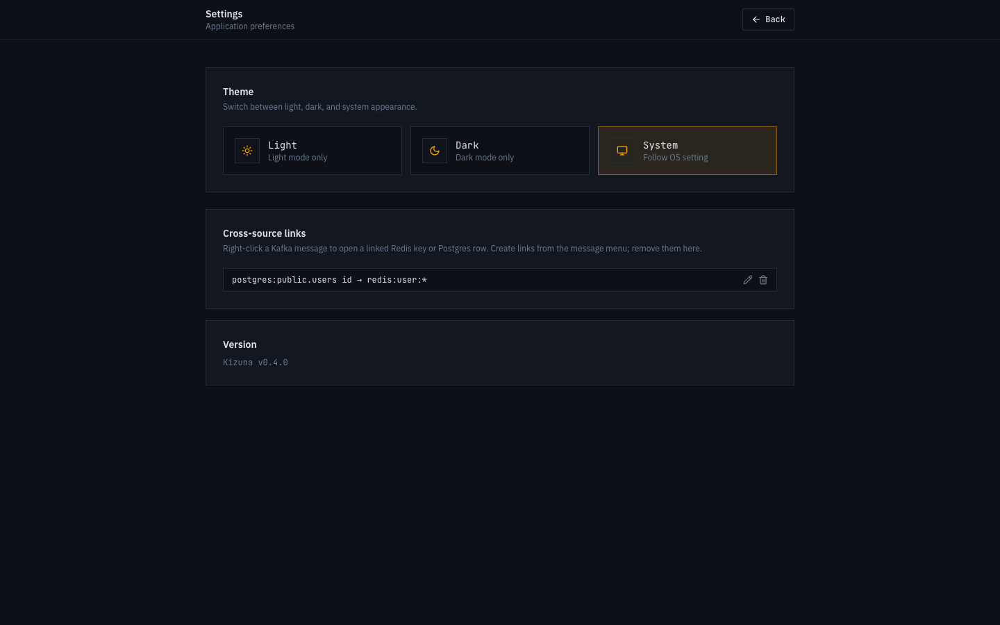

<div align="center">

# 絆 kizuna

**Один веб-интерфейс для PostgreSQL, Redis и Kafka — просмотр, редактирование и анализ данных.**

Заменяет pgAdmin + Redis Desktop Manager + Kafka UI одним лёгким контейнером.

[](LICENSE)
[](https://go.dev)
[](https://react.dev)

Русский | [English](README.en.md)



</div>

## Быстрый старт

```bash
git clone https://github.com/qsnake66/kizuna.git
cd kizuna
docker compose up -d --build
```

Откройте **http://localhost:9090** и добавьте первое подключение.

Конфигурация хранится в Docker-томе `kizuna-data`. Пароли подключений шифруются AES-256-GCM.

<details>
<summary><b>Запуск из исходников (без Docker)</b></summary>

Нужны Go 1.26+ и Node 20+.

```bash
cd frontend && npm install && npm run build && cd ..
go run ./cmd/kizuna
```

Фронтенд встраивается в единый Go-бинарь; всё работает на порту 9090.

</details>

## Возможности

### PostgreSQL



- Дерево схем: таблицы, представления, индексы, количество строк
- Просмотр данных с фильтрами, сортировкой и пагинацией
- Редактирование ячеек на месте, добавление и удаление строк — по одной или пачкой
- Переход по foreign key в один клик, возврат через breadcrumbs; **Referenced By** открывает обратные связи
- DDL-операции и инспектор индексов



- SQL-консоль с автодополнением, многооператорными скриптами и историей запросов
- **EXPLAIN** / **EXPLAIN ANALYZE** в один клик

### Redis



- Дерево ключей, сгруппированное по префиксам
- Типизированные редакторы для String, Hash, List и Sorted Set
- Управление TTL, создание ключей, массовые операции
- Встроенная CLI-консоль

### Kafka



- Топики с партициями и consumer groups
- Браузер сообщений с JSON-представлением и поиском по полям сообщения
- Отправка сообщений прямо из UI

### Cross-source links



Связывайте данные между источниками — колонку Postgres с паттерном ключей Redis, поле Kafka-сообщения со строкой в Postgres. Правый клик по строке — и связанная запись открывается в один клик.



Редактировать и удалять линки можно в настройках.

### А ещё

- Тёмная / светлая / системная тема
- Шифрование паролей подключений AES-256-GCM
- Один Go-бинарь со встроенным фронтендом — один контейнер, один порт

## Лицензия

[MIT](LICENSE)
